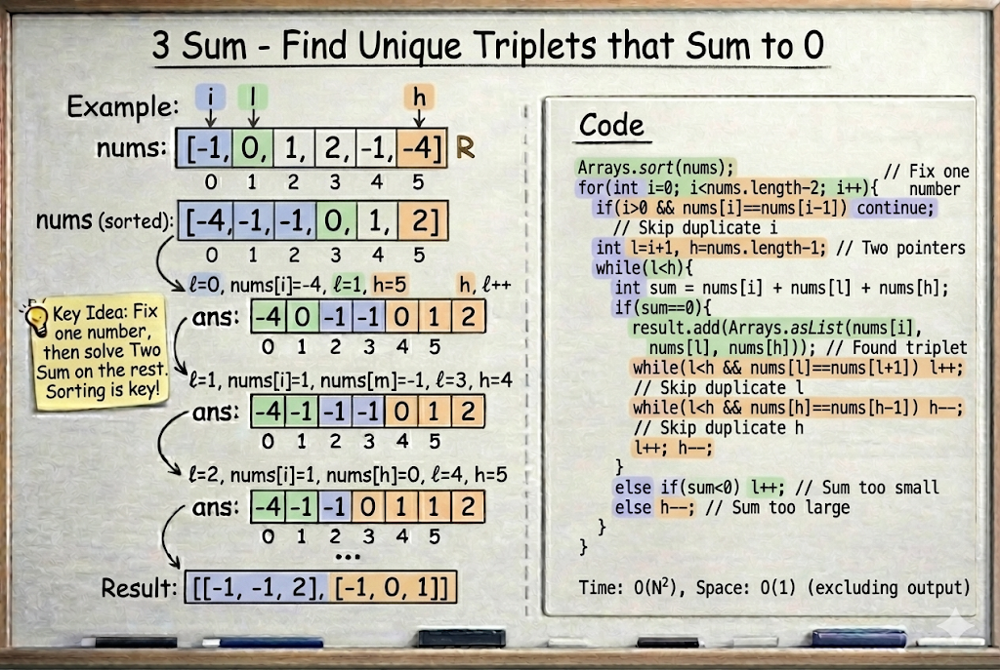

# 3Sum

**Problem Link:** https://leetcode.com/problems/3sum/

## Why this problem?

This problem is a perfect example of the **Two Pointers pattern**.

The signals are clear:

- We are asked to find **triplets**
- We can **sort** the array
- A brute-force approach would be inefficient
- We need an optimized solution

All of these point directly to sorting + two pointers.

---

## The Intuition

We are given an array and asked to find **all unique triplets** whose sum is **0**.

Key idea:

If we **fix one number**, the problem reduces to  
**Two Sum on the remaining part of the array**.

So the steps are:

- Sort the array
- Fix one element
- Use two pointers to find the other two elements

---

## The Algorithm

### Step 1: Sort the array

Sorting allows us to move pointers intelligently.

---

### Step 2: Fix one element

Loop with index `i` from `0` to `n - 1`.

For each `i`:

- Treat `nums[i]` as the **first element**
- Apply Two Pointers on the remaining array

---

### Step 3: Two Pointers

For each fixed `i`:

l = i + 1
h = nums.length - 1


Now check:

sum = nums[i] + nums[l] + nums[h]


- If `sum == 0`
  - Valid triplet found
  - Store it
  - Move both pointers
- If `sum < 0`
  - Move `l` right to increase the sum
- If `sum > 0`
  - Move `h` left to decrease the sum

Continue until `l < h`.

---

## Handling Duplicates

To ensure **unique triplets**, we skip duplicates:

- Skip repeated values of `i`
- Skip repeated values of `l`
- Skip repeated values of `h`

This guarantees no duplicate triplets in the result.

---

## Example

Input:
[-1,0,1,2,-1,-4]


After sorting:
[-4,-1,-1,0,1,2]


Output:
[[-1,-1,2], [-1,0,1]]


---

## Why this works

- Sorting enables smart pointer movement
- Each fixed element uses Two Sum logic
- We avoid unnecessary combinations
- Duplicate handling ensures uniqueness

---

## Visualization



---

## Complexity

- **Time Complexity:** `O(n²)`
- **Space Complexity:** `O(1)` (excluding output)

---

## Java Solution

```java
class Solution {
    public List<List<Integer>> threeSum(int[] nums) {
        Arrays.sort(nums);
        List<List<Integer>> result = new ArrayList<>();
        
        for (int i = 0; i < nums.length - 1; i++) {

            if (i > 0 && nums[i] == nums[i - 1]) {
                continue;
            }

            int l = i + 1;
            int h = nums.length - 1;

            while (l < h) {
                int sum = nums[i] + nums[l] + nums[h];

                if (sum == 0) {
                    result.add(Arrays.asList(nums[i], nums[l], nums[h]));

                    while (l < h && nums[l] == nums[l + 1]) l++;
                    while (l < h && nums[h] == nums[h - 1]) h--;

                    l++;
                    h--;
                } 
                else if (sum < 0) {
                    l++;
                } 
                else {
                    h--;
                }
            }
        }
        return result;
    }
}