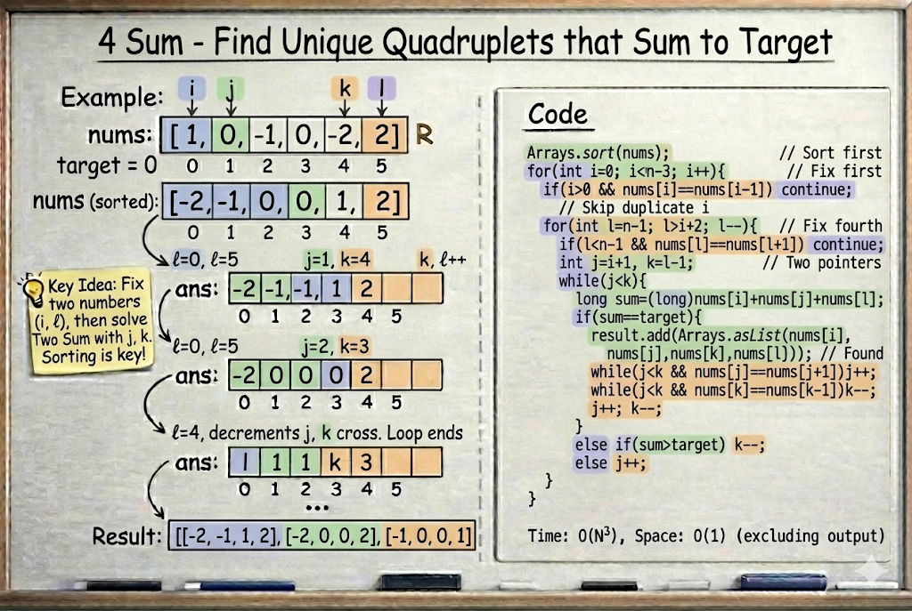

# 4Sum

**Problem Link:** https://leetcode.com/problems/4sum/

## Why this problem?

This problem is a natural extension of **2Sum** and **3Sum** and is a classic example of the **Two Pointers pattern** applied to the **K-Sum** family.

The signals are clear:

- We are asked to find **quadruplets**
- The array can be **sorted**
- We must avoid **duplicate results**
- A brute-force solution would be too slow

This leads directly to sorting + nested loops + two pointers.

---

## The Intuition

We are given an array and a target value.

Our goal is to find **all unique quadruplets** such that:

nums[a] + nums[b] + nums[c] + nums[d] = target


Key idea:

If we **fix two numbers**, the remaining problem becomes a **Two Sum** problem.

So the overall flow is:

Sort → Fix first → Fix second → Two Pointers


---

## The Algorithm

### Step 1: Sort the array

Sorting helps in:
- Efficient pointer movement
- Easy duplicate handling

---

### Step 2: Fix the first and last elements

- Loop with `i` for the **first number**
- Loop with `l` for the **last number**

---

### Step 3: Two Pointers for the middle elements

For each `(i, l)` pair:

j = i + 1
k = l - 1


Now check:

sum = nums[i] + nums[j] + nums[k] + nums[l]


- If `sum == target`
  - Valid quadruplet found
  - Store it
  - Move both pointers
- If `sum > target`
  - Move `k` left to decrease the sum
- If `sum < target`
  - Move `j` right to increase the sum

Continue until `j < k`.

---

## Handling Duplicates

To ensure **unique quadruplets**, we skip:

- Repeated values of `i`
- Repeated values of `l`
- Repeated values of `j`
- Repeated values of `k`

This guarantees no duplicate answers.

---

## Example

Input:
nums = [1,0,-1,0,-2,2]
target = 0


After sorting:
[-2,-1,0,0,1,2]


Output:
[[-2,-1,1,2], [-2,0,0,2], [-1,0,0,1]]


---

## Why this works

- Sorting allows pointers to move intelligently
- Two fixed elements reduce the problem to Two Sum
- Duplicate skipping ensures unique results
- Avoids unnecessary combinations

This is the complete **K-Sum pattern** built on Two Pointers.

---

## Complexity

- **Time Complexity:** `O(n³)`
- **Space Complexity:** `O(1)` (excluding output)

---

## Visualization



---

## Java Solution

```java
class Solution {
    public List<List<Integer>> fourSum(int[] nums, int target) {
        Arrays.sort(nums);
        List<List<Integer>> result = new ArrayList<>();
        int n = nums.length;
        long sum;

        for (int i = 0; i < n - 3; i++) {

            if (i > 0 && nums[i] == nums[i - 1]) continue;

            for (int l = n - 1; l > i + 2; l--) {

                if (l < n - 1 && nums[l] == nums[l + 1]) continue;

                int j = i + 1;
                int k = l - 1;

                while (j < k) {
                    sum = (long) nums[i] + nums[j] + nums[k] + nums[l];

                    if (sum == target) {
                        result.add(Arrays.asList(nums[i], nums[j], nums[k], nums[l]));

                        while (j < k && nums[j] == nums[j + 1]) j++;
                        while (j < k && nums[k] == nums[k - 1]) k--;

                        j++;
                        k--;
                    } 
                    else if (sum > target) {
                        k--;
                    } 
                    else {
                        j++;
                    }
                }
            }
        }
        return result;
    }
}
