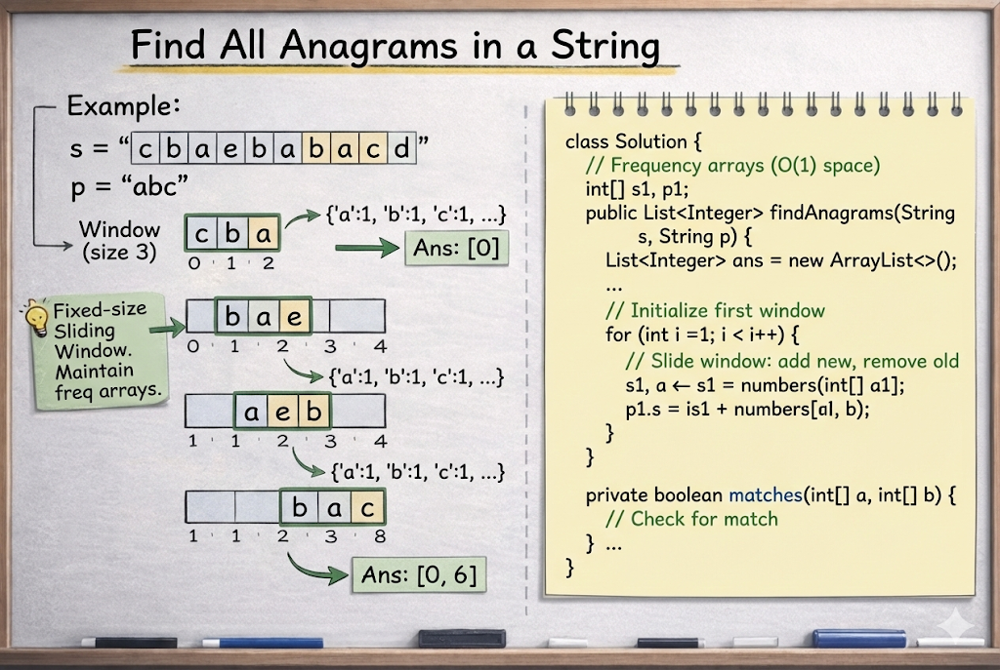

# Find All Anagrams in a String

**Problem Link:** https://leetcode.com/problems/find-all-anagrams-in-a-string/

## Why this problem?

This problem is a classic example of the **Sliding Window pattern** with a **fixed-size window**.

The signals are clear:

- We are working with **substrings**
- Anagrams must have the **same length**
- Anagrams must have the **same character frequency**
- Only lowercase English letters are involved

This directly leads to a **fixed-size Sliding Window** approach.

---

## The Intuition

We are given two strings `s` and `p`.

Our goal is to find **all starting indices** in `s` where an anagram of `p` exists.

Key observation:

- Anagrams have identical character frequencies
- Order does not matter
- Window size is always `p.length()`

So, if any substring of `s` with length `p.length()` has the **same frequency array** as `p`, it is an anagram.

---

## The Algorithm

### Step 1: Edge case

If `s.length() < p.length()`, return an empty list.

---

### Step 2: Initialize frequency arrays

- Create a frequency array for string `p`
- Create a frequency array for the first window of string `s`

---

### Step 3: Slide the window

For each step:
- Add the new character entering the window
- Remove the character leaving the window
- Compare both frequency arrays

If they match, store the starting index.

---

## Example

Input:
s = "cbaebabacd"
p = "abc"


Output:
[0, 6]


Explanation:
"cba" and "bac" are anagrams of "abc"


---

## Why this works

- The window size is fixed
- Only 26 lowercase letters are tracked
- Each character is added and removed exactly once
- Frequency comparison is constant time

---

## Complexity

- **Time Complexity:** `O(n)`
- **Space Complexity:** `O(1)`

---




## Java Solution

```java
class Solution {
    public List<Integer> findAnagrams(String s, String p) {
        List<Integer> ans = new ArrayList<>();
        if (s.length() < p.length()) return ans;

        int[] s1 = new int[26];
        int[] p1 = new int[26];

        for (int i = 0; i < p.length(); i++) {
            p1[p.charAt(i) - 'a']++;
            s1[s.charAt(i) - 'a']++;
        }

        for (int i = p.length(); i < s.length(); i++) {
            if (matches(p1, s1)) ans.add(i - p.length());
            s1[s.charAt(i) - 'a']++;
            s1[s.charAt(i - p.length()) - 'a']--;
        }

        if (matches(p1, s1)) ans.add(s.length() - p.length());
        return ans;
    }

    private boolean matches(int[] a, int[] b) {
        for (int i = 0; i < 26; i++) {
            if (a[i] != b[i]) return false;
        }
        return true;
    }
}