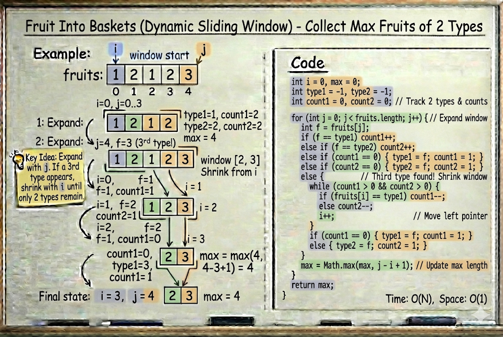

# Fruit Into Baskets

**Problem Link:** https://leetcode.com/problems/fruit-into-baskets/

## Why this problem?

This problem is a classic example of the **Sliding Window pattern**.

The signals are clear:

- Fruits must be picked from **contiguous trees**
- We are allowed **at most 2 distinct fruit types**
- We want the **maximum length subarray** satisfying a condition

This directly points to a **variable-size Sliding Window** approach.

---

## The Intuition

We are given an array where each number represents a fruit type.

Rules:
- We have **only two baskets**
- Each basket can store **only one type of fruit**
- We must pick fruits **continuously**

Our goal is to find the **longest contiguous subarray** containing **at most two distinct values**.

---

## The Algorithm

We use a sliding window with two pointers:

- `i` → start of the window
- `j` → end of the window

Inside the window, we track:
- Two fruit types (`type1`, `type2`)
- Their counts (`count1`, `count2`)

---

### How the window moves

As we expand `j`:

- If the fruit matches one of the existing types  
  → increase its count
- If one basket is empty  
  → assign the new fruit type
- If a **third fruit type appears**  
  → shrink the window from the left (`i`)  
  → remove fruits until only two types remain

At every step, update the maximum window size.

---

## Example

Input:
[1,2,1,2,3]


Output:
4


Explanation:
[1,2,1,2] → valid window with 2 types


---

## Why this works

- The window always contains **at most two fruit types**
- Each element is added and removed **at most once**
- Ensures optimal traversal

---

## Complexity

- **Time Complexity:** `O(n)`
- **Space Complexity:** `O(1)`

---




## Java Solution

```java
class Solution {
    public int totalFruit(int[] fruits) {
        int i = 0, max = 0;
        int type1 = -1, type2 = -1;
        int count1 = 0, count2 = 0;

        for (int j = 0; j < fruits.length; j++) {
            int f = fruits[j];

            if (f == type1) {
                count1++;
            } else if (f == type2) {
                count2++;
            } else if (count1 == 0) {
                type1 = f;
                count1 = 1;
            } else if (count2 == 0) {
                type2 = f;
                count2 = 1;
            } else {
                while (count1 > 0 && count2 > 0) {
                    if (fruits[i] == type1) count1--;
                    else count2--;
                    i++;
                }

                if (count1 == 0) {
                    type1 = f;
                    count1 = 1;
                } else {
                    type2 = f;
                    count2 = 1;
                }
            }

            max = Math.max(max, j - i + 1);
        }

        return max;
    }
}


