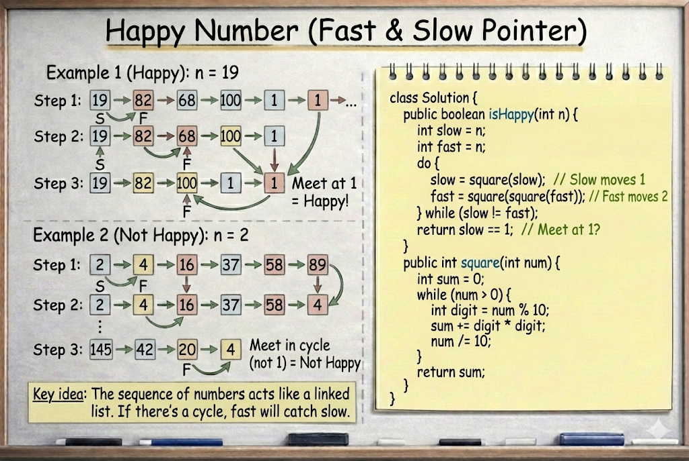

# Happy Number

**Problem Link:** https://leetcode.com/problems/happy-number/

## Why this problem?

This problem is a great example of the **Slow & Fast Pointer pattern** applied outside of linked lists.

The signals are clear:

- The problem involves **repeated transformations**
- We need to detect a **cycle**
- The solution must use **O(1) extra space**

Even though this is not a linked list,  
the sequence of generated numbers behaves like one.

---

## The Intuition

We are given a number `n`.

We repeatedly replace it with the **sum of squares of its digits**.

- If the process ends at **1**, the number is **happy**
- If it enters a **cycle that does not include 1**, the number is **not happy**

Instead of storing seen values,  
we use **pointer speed difference** to detect a cycle.

---

## The Algorithm

We use two pointers:

- `slow` → moves **one step** (one transformation)
- `fast` → moves **two steps** (two transformations)

So in each iteration:

slow = f(slow)
fast = f(f(fast))


This makes fast gain **one extra step** over slow.

---

## What Happens

- If the number is **happy**
  - Both pointers will eventually meet at `1`
- If the number is **not happy**
  - Both pointers will meet **inside a cycle**

When `slow == fast`, the loop stops.

---

## Why this works

If a cycle exists,
a faster pointer will always catch a slower pointer.

This is the same logic used in **cycle detection for linked lists**.

---

## Complexity

- **Time Complexity:** `O(log n)` per transformation (digit processing), with bounded iterations
- **Space Complexity:** `O(1)`

---

## Visualization



---

## Java Solution

```java
class Solution {
    public boolean isHappy(int n) {
        int slow = n;
        int fast = n;

        do {
            slow = square(slow);
            fast = square(square(fast));
        } while (slow != fast);

        return slow == 1;
    }

    public int square(int num) {
        int sum = 0;
        while (num > 0) {
            int digit = num % 10;
            sum += digit * digit;
            num /= 10;
        }
        return sum;
    }
}
