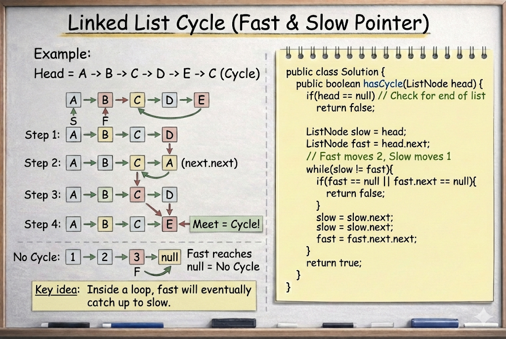

# Linked List Cycle

**Problem Link:** https://leetcode.com/problems/linked-list-cycle/

## Why this problem?

This problem is the **textbook use case** of the **Slow & Fast Pointer pattern**.

The signals are clear:

- The input is a **linked list**
- We are checking for a **cycle (loop)**
- The problem asks for an **O(1) space** solution

All of these directly point to using Fast & Slow Pointers.

---

## The Intuition

We are given the head of a linked list.

Our task is to check whether the list contains a **cycle**.

A cycle means:
- While moving forward, we **reach the same node again**

Instead of storing visited nodes (extra space),
we rely on **pointer speed difference**.

---

## The Algorithm

We use two pointers:

- `slow` → moves **one step** at a time
- `fast` → moves **two steps** at a time

So on every iteration:

slow → 1 node
fast → 2 nodes


This means fast gains **one extra node** over slow each move.

---

## What Happens

### Case 1: No cycle

- `fast` or `fast.next` becomes `null`
- This means the list ends
- Return `false`

---

### Case 2: Cycle exists

- `fast` keeps looping inside the cycle
- Since it moves faster, it will **eventually catch up to slow**
- When `slow == fast`, a cycle is confirmed

---

## Why this works (Intuition)

Inside a loop:

> A faster runner will always lap a slower runner  
> if they keep moving in a circle.

This same idea applies to pointers in a linked list.

---

## Complexity

- **Time Complexity:** `O(n)`
- **Space Complexity:** `O(1)`

---

## Visualization



---

## Java Solution

```java
public class Solution {
    public boolean hasCycle(ListNode head) {
        if (head == null) return false;

        ListNode slow = head;
        ListNode fast = head.next;

        while (slow != fast) {
            if (fast == null || fast.next == null) {
                return false;
            }
            slow = slow.next;
            fast = fast.next.next;
        }
        return true;
    }
}