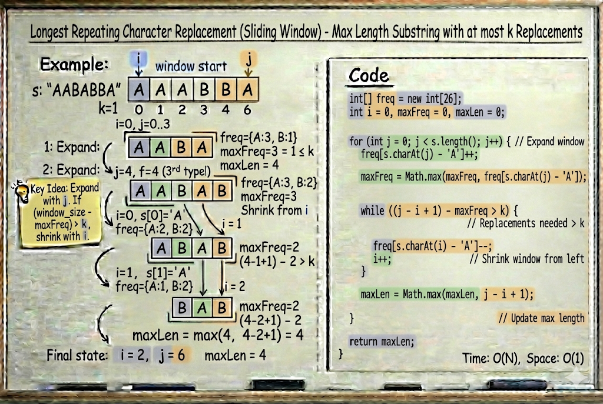

# Longest Repeating Character Replacement

**Problem Link:** https://leetcode.com/problems/longest-repeating-character-replacement/

## Why this problem?

This problem is a classic example of the **Sliding Window pattern**.

The signals are clear:

- We are working with **substrings**
- The substring must be **continuous**
- We are allowed **at most `k` changes**
- We want the **longest valid window**

This directly leads to a **variable-size Sliding Window** solution.

---

## The Intuition

We are given a string `s` and an integer `k`.

We can replace **at most `k` characters** in any substring.

Our goal is to find the **longest substring** that can be converted into  
**all the same characters** using at most `k` replacements.

Key observation:

In any window, we only need to replace characters that are **not equal to the most frequent character**.

So:

replacements needed = window size - max frequency in window


This value must be **≤ k**.

---

## The Algorithm

We use a sliding window with two pointers:

- `i` → start of the window
- `j` → end of the window

We maintain:
- A frequency array for characters
- `maxFreq` → count of the most frequent character in the current window

---

### How the window moves

As we expand `j`:

- Update the frequency of `s[j]`
- Update `maxFreq`

If at any point:

(window size - maxFreq) > k


- The window becomes invalid
- Shrink the window from the left (`i`)

At every step, update the maximum window length.

---

## Example

Input:
s = "AABABBA", k = 1


Output:
4


Explanation:
"ABBB" → replace one 'A' to get all 'B'


---

## Why this works

- The window always represents the longest valid substring so far
- We never need to decrease `maxFreq` (optimization)
- Each character enters and leaves the window at most once

---

## Complexity

- **Time Complexity:** `O(n)`
- **Space Complexity:** `O(1)` (fixed-size frequency array)

---





## Java Solution

```java
class Solution {
    public int characterReplacement(String s, int k) {
        int[] freq = new int[26];
        int i = 0;
        int maxFreq = 0;
        int maxLen = 0;

        for (int j = 0; j < s.length(); j++) {
            freq[s.charAt(j) - 'A']++;
            maxFreq = Math.max(maxFreq, freq[s.charAt(j) - 'A']);

            while ((j - i + 1) - maxFreq > k) {
                freq[s.charAt(i) - 'A']--;
                i++;
            }

            maxLen = Math.max(maxLen, j - i + 1);
        }

        return maxLen;
    }
}
