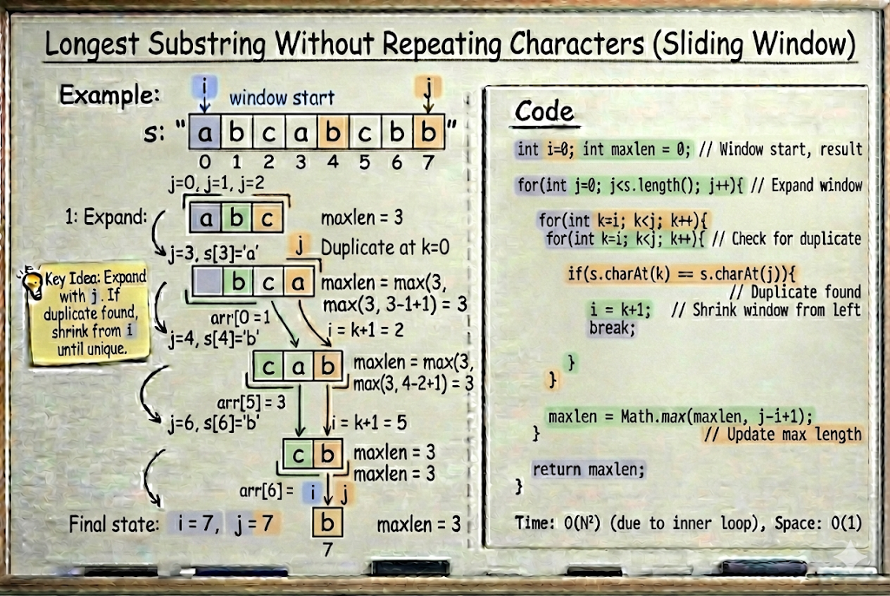

# Longest Substring Without Repeating Characters — Sliding Window Approach

---

## Problem Statement

We are given a string and asked to find the **longest contiguous substring**
that contains **no repeated characters**.

---

## Key Observations

- We are dealing with **substrings** → must be contiguous  
- The window size is **not fixed**  
- We must maintain a window with **only unique characters**

This makes it a classic **Dynamic Sliding Window** problem.

---

## Core Idea (Sliding Window)

We use two pointers:

- `i` → start of the window  
- `j` → end of the window  

And a set (or hashmap) to track characters inside the window.

---

## Step-by-Step Logic

1. Expand the window by moving `j` forward.
2. If `s[j]` is **not present** in the window:
   - Add it
   - Update maximum length
3. If `s[j]` is **already present**:
   - Move `i` forward
   - Remove characters until the duplicate is gone
4. Continue until `j` reaches the end of the string.

---

## Why This Works

- The window always contains **unique characters**
- Each character is:
  - Added once
  - Removed once

So the total operations are linear.

---

## Time & Space Complexity

- **Time Complexity:** `O(n)`
- **Space Complexity:** `O(n)` (for storing characters in the window)

---

## Summary

This is a textbook **Dynamic Sliding Window** problem where:

- The window expands and shrinks dynamically
- We maintain uniqueness inside the window
- We optimize for maximum length

Efficient and optimal.

---


```java
class Solution {
    public int lengthOfLongestSubstring(String s) {
        
        int i=0;
        int maxlen = 0;
        for(int j=0;j<s.length();j++){
            for(int k=i;k<j;k++){
                if(s.charAt(k)== s.charAt(j)){
                    i=k+1;
                    break;
                }
            }
            maxlen = Math.max(maxlen, j-i+1);
        }
        return maxlen;
    }
}