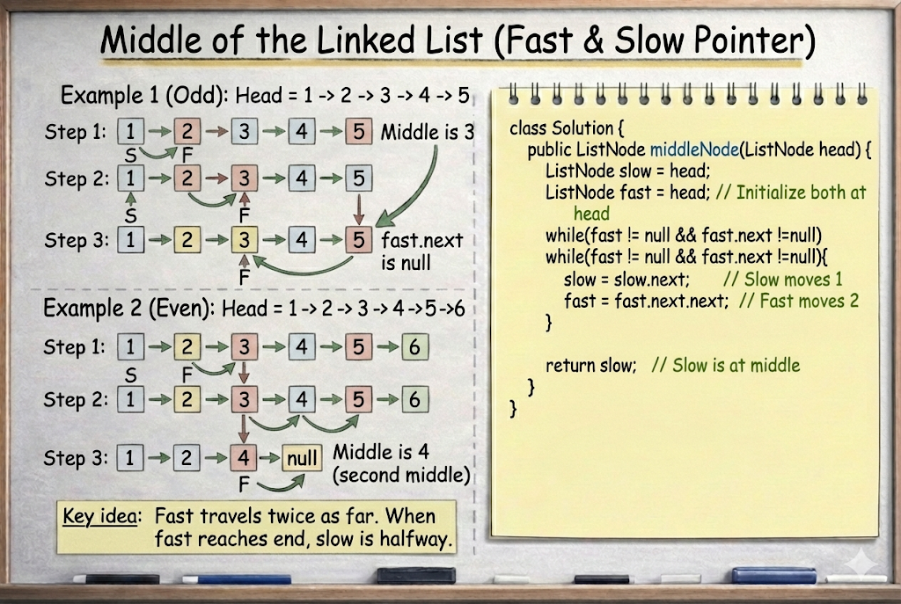

# Middle of the Linked List

**Problem Link:** https://leetcode.com/problems/middle-of-the-linked-list/

## Why this problem?

This problem is a classic application of the **Slow & Fast Pointer pattern**.

The signals are clear:

- The data structure is a **linked list**
- We are asked to find the **middle node**
- We need an **O(1) space** solution

All of these point directly to using Fast & Slow Pointers.

---

## The Intuition

We are given the head of a singly linked list.

Our task is to return the **middle node**.

Special case:
- If the list has **two middle nodes**, we must return the **second one**

Instead of counting nodes or using extra space,
we rely on **pointer speed difference**.

---

## The Algorithm

We use two pointers:

- `slow` → moves **one step** at a time
- `fast` → moves **two steps** at a time

---

## What Happens

- When the `fast` pointer reaches the end of the list
- The `slow` pointer will be at the **middle**

If the list length is even:
- `fast` reaches the end early
- `slow` automatically lands on the **second middle node**

---

## Why this works

Fast pointer moves **twice as fast** as slow.

So when fast finishes traversing the list,
slow has covered exactly **half the distance**.

---

## Example

Input:
[1,2,3,4,5,6]


Output:
4


Explanation:
Two middle nodes → 3 and 4
Second middle → 4


---

## Complexity

- **Time Complexity:** `O(n)`
- **Space Complexity:** `O(1)`

---

## Visualization



---


## Java Solution

```java
class Solution {
    public ListNode middleNode(ListNode head) {
        ListNode slow = head;
        ListNode fast = head;

        while (fast != null && fast.next != null) {
            slow = slow.next;
            fast = fast.next.next;
        }

        return slow;
    }
}