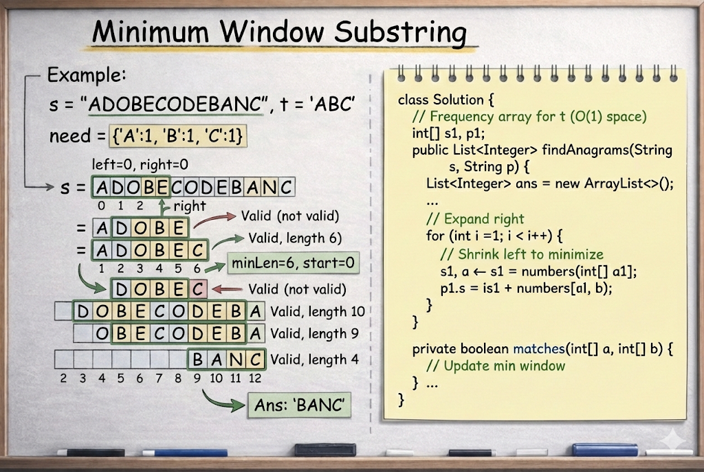

# Minimum Window Substring

**Problem Link:** https://leetcode.com/problems/minimum-window-substring/

## Why this problem?

This problem is a classic example of the **Sliding Window pattern** with a **variable-size window**.

The signals are clear:

- We are working with **substrings**
- The substring must contain **all characters of `t`**
- **Duplicates matter**
- We want the **smallest valid window**

This directly points to a **variable-size Sliding Window** approach.

---

## The Intuition

We are given two strings `s` and `t`.

Our task is to find the **smallest substring of `s`** that contains  
**all characters of `t` (including duplicates)**.

Key idea:

We maintain a window that **covers all required characters** of `t`.

Once the window becomes valid, we **shrink it** from the left to make it as small as possible.

---

## The Algorithm

### Step 1: Store requirements

- Create a frequency array for characters of `t`

---

### Step 2: Sliding window setup

Use two pointers:

- `left` → start of the window  
- `right` → end of the window  

Also maintain:
- `required` → number of characters still needed to form a valid window
- `minLen` → length of the minimum window found
- `start` → starting index of the minimum window

---

### Step 3: Expand window

As we move `right`:
- Decrease frequency from `need`
- If a required character is matched → decrement `required`

---

### Step 4: Shrink window

When `required == 0`:
- Update minimum window
- Shrink from the left to remove extra characters
- Stop shrinking when window becomes invalid again

---

## Example

Input:
s = "ADOBECODEBANC"
t = "ABC"


Output:
"BANC"


---

## Why this works

- Window expands to **include all required characters**
- Window shrinks to **minimize size**
- Each character enters and leaves the window once
- Ensures optimal performance

---

## Complexity

- **Time Complexity:** `O(n)`
- **Space Complexity:** `O(1)`

---




## Java Solution

```java
class Solution {
    public String minWindow(String s, String t) {
        if (s.length() < t.length()) return "";

        int[] need = new int[128];
        for (char c : t.toCharArray()) need[c]++;

        int left = 0, right = 0;
        int required = t.length();
        int minLen = Integer.MAX_VALUE, start = 0;

        while (right < s.length()) {
            char c = s.charAt(right);
            if (need[c] > 0) required--;
            need[c]--;
            right++;

            while (required == 0) {
                if (right - left < minLen) {
                    minLen = right - left;
                    start = left;
                }
                char lc = s.charAt(left);
                need[lc]++;
                if (need[lc] > 0) required++;
                left++;
            }
        }

        return minLen == Integer.MAX_VALUE ? "" : s.substring(start, start + minLen);
    }
}