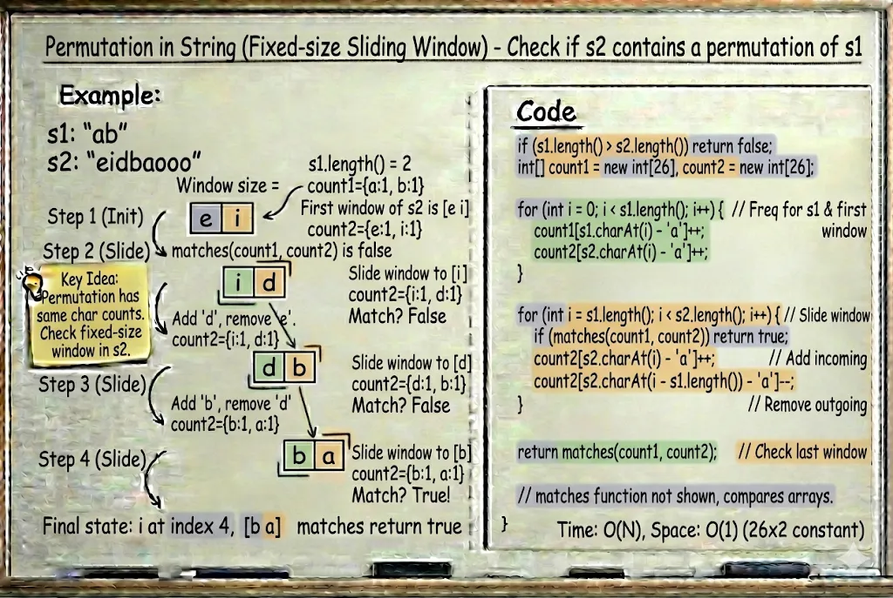

# Permutation in String

**Problem Link:** https://leetcode.com/problems/permutation-in-string/

## Why this problem?

This problem is a perfect example of the **Sliding Window pattern** with a **fixed-size window**.

The signals are clear:

- We are checking for a **substring**
- The substring must have the **same length** as `s1`
- Character counts must match exactly
- The alphabet size is fixed (26 lowercase letters)

This naturally leads to a **fixed-size Sliding Window** solution.

---

## The Intuition

We are given two strings `s1` and `s2`.

Our task is to check whether **any permutation of `s1`** appears as a **substring of `s2`**.

Key observation:

- A permutation has the **same character frequencies**
- The order does not matter
- The window size is always `s1.length()`

So, if any window in `s2` has the **same frequency array** as `s1`, a permutation exists.

---

## The Algorithm

### Step 1: Edge case

If `s1` is longer than `s2`, return `false`.

---

### Step 2: Initialize frequency arrays

- Create a frequency array `count1` for `s1`
- Create a frequency array `count2` for the first window of `s2`

---

### Step 3: Slide the window

For each step:
- Add the new character entering the window
- Remove the character leaving the window
- Compare both frequency arrays

If they match at any point, return `true`.

---

## Example

Input:
s1 = "ab"
s2 = "eidbaooo"


Output:
true


Explanation:
"ba" is a permutation of "ab"


---

## Why this works

- The window size is fixed
- Only 26 characters are tracked
- Each slide updates frequencies in constant time
- Ensures optimal performance

---

## Complexity

- **Time Complexity:** `O(n)`
- **Space Complexity:** `O(1)`

---




## Java Solution

```java
class Solution {
    public boolean checkInclusion(String s1, String s2) {
        if (s1.length() > s2.length()) return false;

        int[] count1 = new int[26];
        int[] count2 = new int[26];

        for (int i = 0; i < s1.length(); i++) {
            count1[s1.charAt(i) - 'a']++;
            count2[s2.charAt(i) - 'a']++;
        }

        for (int i = s1.length(); i < s2.length(); i++) {
            if (matches(count1, count2)) return true;

            count2[s2.charAt(i) - 'a']++;
            count2[s2.charAt(i - s1.length()) - 'a']--;
        }

        return matches(count1, count2);
    }

    private boolean matches(int[] a, int[] b) {
        for (int i = 0; i < 26; i++) {
            if (a[i] != b[i]) return false;
        }
        return true;
    }
}
