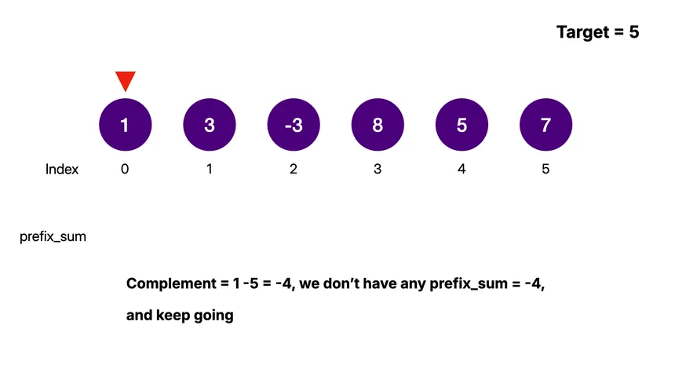

# Pattern: Prefix Sum

Prefix Sum is a technique used to **precompute cumulative information**  
so that **range-based queries** can be answered efficiently.

Instead of recalculating sums again and again,  
we compute results once and **reuse them**.

---

## Why Prefix Sum is used

Many problems repeatedly ask about:

- Sum of a **subarray**
- Sum between **two indices**
- **Frequency / balance** within a range

Doing this with loops every time is inefficient.

Prefix Sum reduces **repeated work** and improves performance.

---

## When should you think of Prefix Sum?

You’ll usually see these hints in the problem:

- The input is an **array**
- The problem talks about:
  - subarray or range
  - cumulative sum
  - count within a range
- You see **repeated calculations** on overlapping ranges
- Time limits suggest **O(n)** preprocessing or **O(1)** queries

If these appear together, Prefix Sum is a strong match.

---

## How the pattern works (Idea)

We build a new array where:

prefix[i] = sum of elements from index 0 to i

Once built, this allows:

- Fast range sum queries
- Quick comparisons between segments
- Efficient subarray calculations

Example range sum:

sum(l → r) = prefix[r] - prefix[l - 1]

---

## Visualization

---

## Why this pattern is powerful

- Converts **nested loops** into a **single pass**
- Avoids recomputation
- Often combined with **HashMap** for advanced problems
- Forms the foundation for many optimized solutions

---

## Key Takeaway

If you see:

Range queries + repeated sums

👉 **Think Prefix Sum immediately.**
