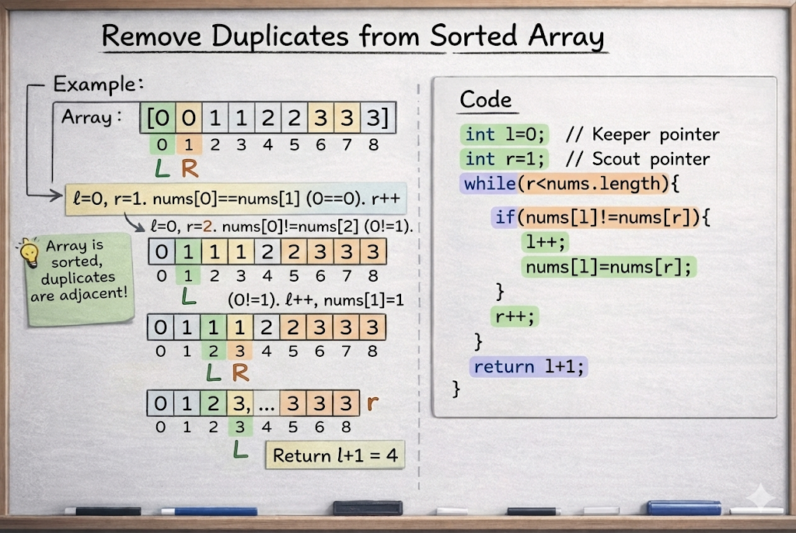

# Remove Duplicates from Sorted Array

**Problem Link:** https://leetcode.com/problems/remove-duplicates-from-sorted-array/

## Why this problem?

This problem is chosen because it is a perfect example of the **Two Pointers pattern**.

The signals are clear:

1. The input is an array  
2. The array is already sorted  
3. We are asked to modify the array in-place  

All three directly point to using Two Pointers.

---

## The Intuition

Since the array is sorted, all duplicate elements appear next to each other.

Our goal is to:
- Keep only unique elements
- Shift them to the front of the array
- Return the count of unique elements

We do not need extra space. We simply overwrite duplicates.

---

## The Algorithm

We use two pointers:

- `l` → points to the last unique element  
- `r` → scans the array to find new elements  

### Initial Setup

l = 0
r = 1


### At each step:

* **If nums[r] != nums[l]**
    * We found a new unique number
    * Move `l` forward
    * Copy `nums[r]` to `nums[l]`

* Always move `r` forward

---

## Example

Input:
[0,0,1,1,2,2,3,3,3]


Output:
4, [0,1,2,3]


---

## Why this works

Because the array is sorted:
- All duplicates are adjacent
- We only shift unique elements forward
- No extra space is used

---



## Java Solution

```java
class Solution {
    public int removeDuplicates(int[] nums) {
        int l=0;
        int r=1;
        
        while(r<nums.length){
            
            if(nums[l]!= nums[r]){
                l++;
                nums[l]=nums[r];
            }
            r++;
           
        }
        return l+1;
    }
}


