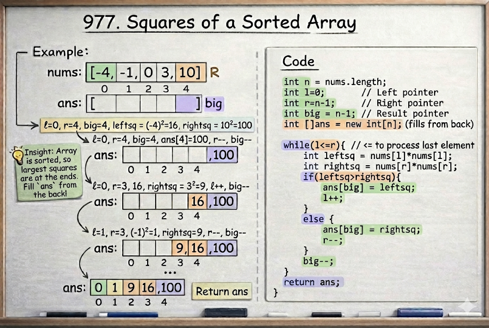

# Squares of a Sorted Array

**Problem Link:** https://leetcode.com/problems/squares-of-a-sorted-array/

## Why this problem?

This problem looks simple at first, but there is a twist.

The array is sorted, but it may contain **negative numbers**.  
When we square numbers, negative values become positive, and the sorted order breaks.

This makes it a perfect use case for the **Two Pointers pattern**.

---

## The Intuition

Consider the input:

[-4, -1, 0, 3, 10]


After squaring:

[16, 1, 0, 9, 100]


This is **not sorted**.

Observation:
- The largest square will always come from either:
  - the leftmost negative number, or
  - the rightmost positive number

So instead of squaring and sorting again, we compare from both ends.

---

## The Algorithm

We use two pointers:

- `l` at the start of the array  
- `r` at the end of the array  

We also create a result array and fill it from the back.

### Steps:

1. Compare `nums[l] * nums[l]` and `nums[r] * nums[r]`
2. Place the larger square at the end of the result array
3. Move the pointer that produced the larger value
4. Move the result index backward
5. Repeat until `l > r`

---

## Example

Input:
[-4, -1, 0, 3, 10]


Process:
Compare | -4 | and | 10 | → 100 goes last
Compare | -4 | and | 3 | → 16 goes next
Compare | -1 | and | 3 | → 9 goes next
Compare | -1 | and | 0 | → 1 goes next
Remaining → 0


Output:
[0, 1, 9, 16, 100]



#Java Solution

```java
class Solution {
    public int[] sortedSquares(int[] nums) {
        int l=0;
        int r=nums.length-1;
        int big = nums.length-1;
        int []ans = new int[nums.length];
        while(l<=r){
            int leftsq = nums[l]*nums[l];
            int rightsq = nums[r]*nums[r];
            if(leftsq>rightsq){
                ans[big] = leftsq;
                l++;
                
            }
            else{
                ans[big] = rightsq;
                r--;
            }
            big--;
        }

        return ans;


    }
}