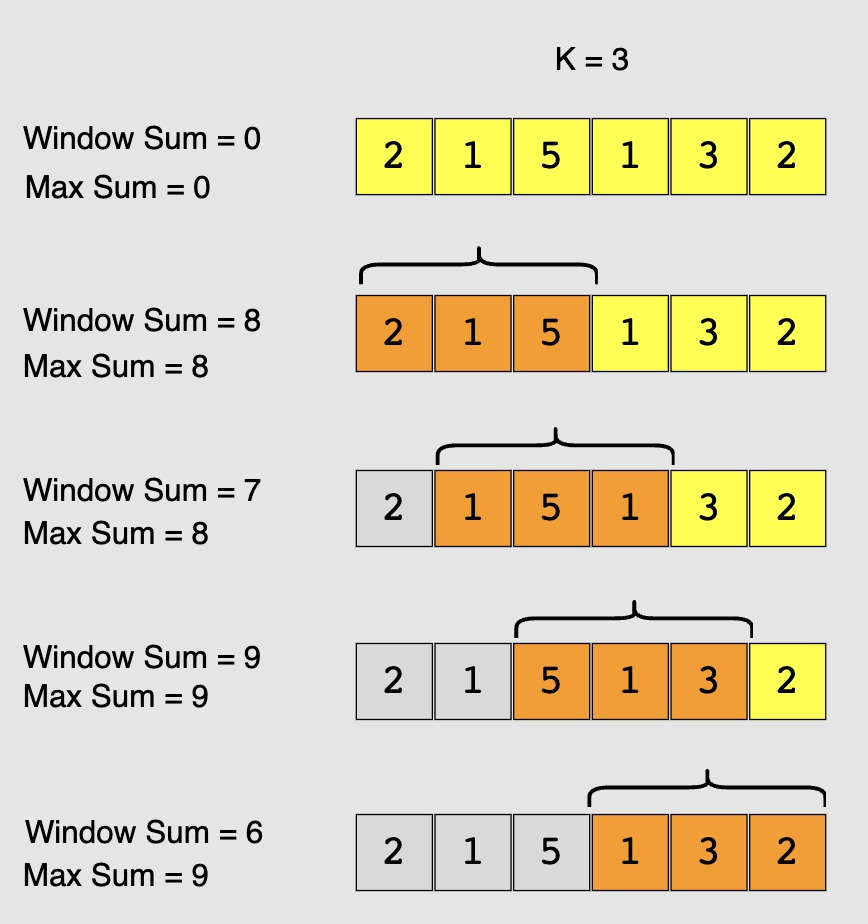

# Pattern 2: Sliding Window

Sliding Window is used when a problem asks us to deal with:

- **subarrays**
- **substrings**
- **ranges**

inside an array or string.

Instead of recomputing everything for each range,  
we reuse the result from the previous window.

This turns slow **O(n²)** solutions into fast **O(n)** solutions.

---

## When should you think of Sliding Window?

You should strongly consider Sliding Window if:

1. The input is an **array or string**
2. The problem talks about:
   - subarray  
   - substring  
   - contiguous elements  
3. You are asked for:
   - maximum or minimum  
   - sum, average, or count  
4. The window size is **fixed** or **changes dynamically**
5. The problem expects an **O(n)** solution

👉 If these appear together, Sliding Window is likely the correct pattern.

---

## How it works (in simple words)

You maintain a window using **two pointers**:

- `left` → start of the window  
- `right` → end of the window  

Steps:
- Expand the window by moving `right`
- Shrink the window by moving `left`
- While doing this, maintain a condition (sum, frequency, count, etc.)

This way, every element is processed only once.

