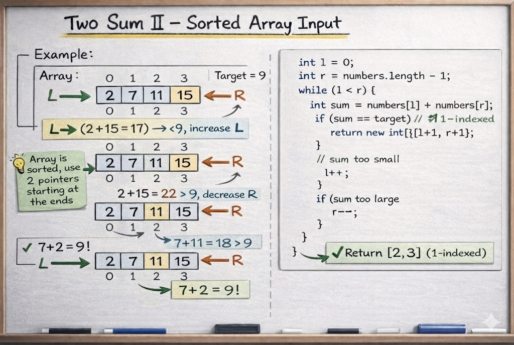

# Two Sum II - Input Array Is Sorted

**Problem Link:** [LeetCode 167 - Two Sum II](https://leetcode.com/problems/two-sum-ii-input-array-is-sorted/description/)

## Why this problem?

This problem is chosen because it clearly demonstrates **when and how** the Two Pointers pattern should be used. It is a textbook example of optimizing a solution by leveraging the sorted property of data.

---

## The Intuition

Given a **sorted array** and a target number, we need to find two numbers whose sum equals the target.

Because the array is sorted, the "Brute Force" approach (checking every pair) is unnecessary and inefficient. Instead, we can use logic to narrow down the search:

1.  We place **one pointer at the start** (`left`).
2.  We place **one pointer at the end** (`right`).

## The Algorithm

At each step, we calculate the `sum` of the numbers at the `left` and `right` pointers:

* **Case 1: `sum == target`**
    * We found the answer! Return the indices.
* **Case 2: `sum < target`**
    * The sum is too small. We need a larger value.
    * Move the **left** pointer forward (`left++`).
* **Case 3: `sum > target`**
    * The sum is too big. We need a smaller value.
    * Move the **right** pointer backward (`right--`).



## Java Solution
```java         
class Solution {
    public int[] twoSum(int[] numbers, int target) {
        int l=0;
        int r=numbers.length-1;
        while(l<r){
            int sum= numbers[l] + numbers[r];
            if(sum==target){
                return new int[]{l+1,r+1};
            }else if(sum<target){
                l++;
            }
            else{
                r--;
            }
        }
        return new int[] {};
    }
}